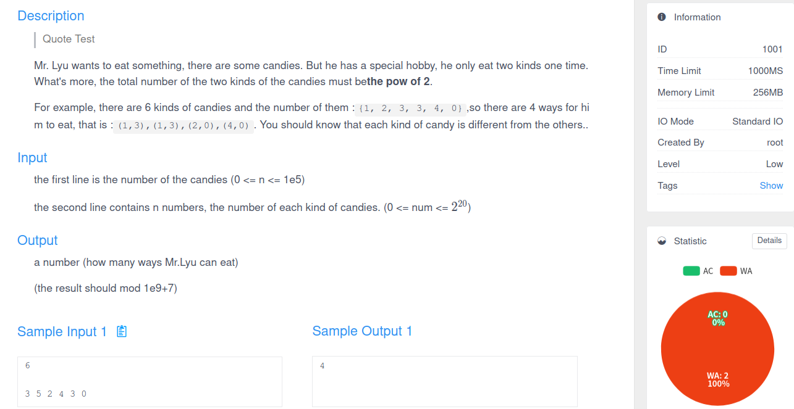

# CUC ACM OJ 使用文档

<p>
<font size="2" color="grey">Author: LyuLumos. Powered by</font>
<a href="https://github.com/QingdaoU/OnlineJudge/blob/master/LICENSE">OnlineJudge</a>
<font size="2" color="grey">. 遵循</font>
<a href="https://github.com/LyuLumos/CUC-ACM-OJ/blob/main/LICENSE">MIT协议</a>
</p>


- [CUC ACM OJ 使用文档](#cuc-acm-oj-使用文档)
  - [开发环境](#开发环境)
  - [账号及权限](#账号及权限)
  - [中英文切换](#中英文切换)
  - [增加题目](#增加题目)
  - [创建比赛](#创建比赛)
  - [语言选择和提交](#语言选择和提交)
    - [C/C++](#cc)
    - [Python](#python)
    - [Java](#java)
    - [Golang](#golang)
  - [Special Judge](#special-judge)
  - [测试数据生成示例](#测试数据生成示例)
  - [其他](#其他)

## 开发环境
- Ubuntu 20.04 Desktop LTS（支持16.04及以上版本）
- based on Vue, Django and Docker


## 账号及权限

账号分为3类，可在管理员页面统一导入 `utf-8` 编码下的 `.csv` 文件（用户+密码+邮箱）或者统一批量生成，也可以由用户自行创建。

- 超级管理员（Super Admin）： 拥有所有权限。
- 普通管理员（Admin）：可以增加题目，创建比赛，发布公告，同时拥有普通用户的所有权限。
- 用户（User）：提交代码、参加比赛。

## 中英文切换

登陆账号后，在 `用户名` -> `Setting` -> `Language` 下更换页面的中英文。


## 增加题目

管理员请在 `用户名` -> `Management` -> `Problem`-> `Create Problem` 下创建目录，目录文本可在输入框最右边选择 `markdown` 语法，默认支持`LaTex`语法，行内公式请使用两个 `$` 包裹公式，单行公式使用两个 `$$`，可在右上角`A`图标处测试 `LaTex` 语法。

各选项的作用分别为：
- Display ID： 展示的题号
- Title： 题目
- Description：题目描述
- Input Description：输入描述
- Output Description：输出描述
- Time Limit：时间限制
- Memories Limit：内存限制
- Difficulty：难度
- Visible：是否公开题目
- Share Submission：是否公开代码
- Tag：标签，必填项请不要忽略
- Languages：允许使用的语言
- Samples：样例
- Hint：备注
- Code Template：代码预设，不建议勾选
- Special Judge：专用
- Type：题目类型选择，`ACM模式`代表`ACM/ICPC 规则`，`OI模式`增加了部分分
- Testcase：测试数据。注意请上传包含 `1.in`、`1.out`、`2.in`...的**zip压缩包**，否则存在风险（可参考NOIP2020）。**只有Special Judge类题目可以不上传 `.out` 文件，没有输入的题目也应上传 `.in` 空文件。**
- IO Mode：IO模式选择，请使用标准IO
- Source：可标注的题目来源

同时，OJ也支持直接传输题目，路径为 `用户名` -> `Management` -> `Problem`-> `Export Or Import Problem`。



## 创建比赛

管理员请在  `用户名` -> `Management` -> `Contest` -> `Create Contest`下创建比赛。

各选项的作用分别为：
- Title： 比赛名称
- Description：比赛描述
- Start Time：开始时间
- End Time：结束时间
- Password：比赛使用的密码
- Contest Rule Type：比赛模式
- Real Time Rank: 比赛前1小时是否封榜
- Status：是否展示实时状态
- Allowed IP Range：限定参与的IP范围，请使用CIDR地址块

比赛题目、实时排名等在 `Contests` 中展示。

只有超级管理员和比赛创建者可查看比赛者提交的代码和各样例评测结果以及封榜后查看实时排名。

## 语言选择和提交
此部分在 `About/FAQ` 中也有说明。
### C/C++

请使用输入输出进行读写，提交的代码不要包含`freopen` `File *`等文件读写的方式。支持`<bits/stdc++.h>`。

### Python

请使用输入输出进行读写。如 `t = int(input())`。

### Java

提交的Java代码**请注释掉本地IDE中 `package` 行**，提交的代码**只包括一个不加任何修饰的主类。**

```java
class Main {
    public static void main(String args[]) {
        System.out.println("Hello World!");
    }
}
```
### Golang
Golang不同于Java，须保留package行。

```golang
package main

import "fmt"

func main() {
 fmt.Println("Hello World!")
}
```

## Special Judge

Special Judge 用于构造或计算几何等答案不唯一的题目。

```cpp
#include <stdio.h>

#define AC 0
#define WA 1
#define ERROR -1

int spj(FILE *input, FILE *user_output);

void close_file(FILE *f){
    if(f != NULL){
        fclose(f);
    }
}

int main(int argc, char *args[]){
    FILE *input = NULL, *user_output = NULL;
    int result;
    if(argc != 3){
        printf("Usage: spj x.in x.out\n");
        return ERROR;
    }
    input = fopen(args[1], "r");
    user_output = fopen(args[2], "r");
    if(input == NULL || user_output == NULL){
        printf("Failed to open output file\n");
        close_file(input);
        close_file(user_output);
        return ERROR;
    }

    result = spj(input, user_output);
    printf("result: %d\n", result);

    close_file(input);
    close_file(user_output);
    return result;
}

int spj(FILE *input, FILE *user_output){
    /*
      parameter: 
        - input，标程输入的文件指针
        - user_output，用户输出文件的指针
      return: 
        - 如果用户答案正确，返回AC
        - 如果用户答案错误返回WA
        - 如果主动捕获到自己的错误，如内存分配失败，返回ERROR
      请完成此函数.
      demo:
      int a, b;
      while(fscanf(f, "%d %d", &a, &b) != EOF){
          if(a-b != 3){
              return WA;
          }
      }
      return AC;
     */
}
```
## 测试数据生成示例

我们建议使用专业的软件进行数据生成，如果题目限制比较简单可以使用以下程序生成。

```cpp
#include <bits/stdc++.h>
using namespace std;
#define random(a,b) ((a)+rand()%((b)-(a)+1))
stringstream ss;

int main( int argc, char *argv[] ) {
	freopen("1.in", "w", stdout);
	int seed=time(NULL);
	if(argc) {
		ss.clear();
		ss<<argv[1];
		ss>>seed;
	}
	srand(seed);
	// 以上为随机数初始化，请勿修改

    // 要生成的数据

	return 0;
}
```

```cpp
#include <bits/stdc++.h>
using namespace std;

int main() {
	freopen("1.in", "r", stdin);
	freopen("1.out", "w", stdout);

    // 正确程序

    return 0;
}
```
## 其他

有关此项目的建议请联系 [LyuLumos](mailto:3208413453@qq.com) 或在 [Discussion](https://github.com/LyuLumos/CUC-ACM-OJ/discussions) 中提出。